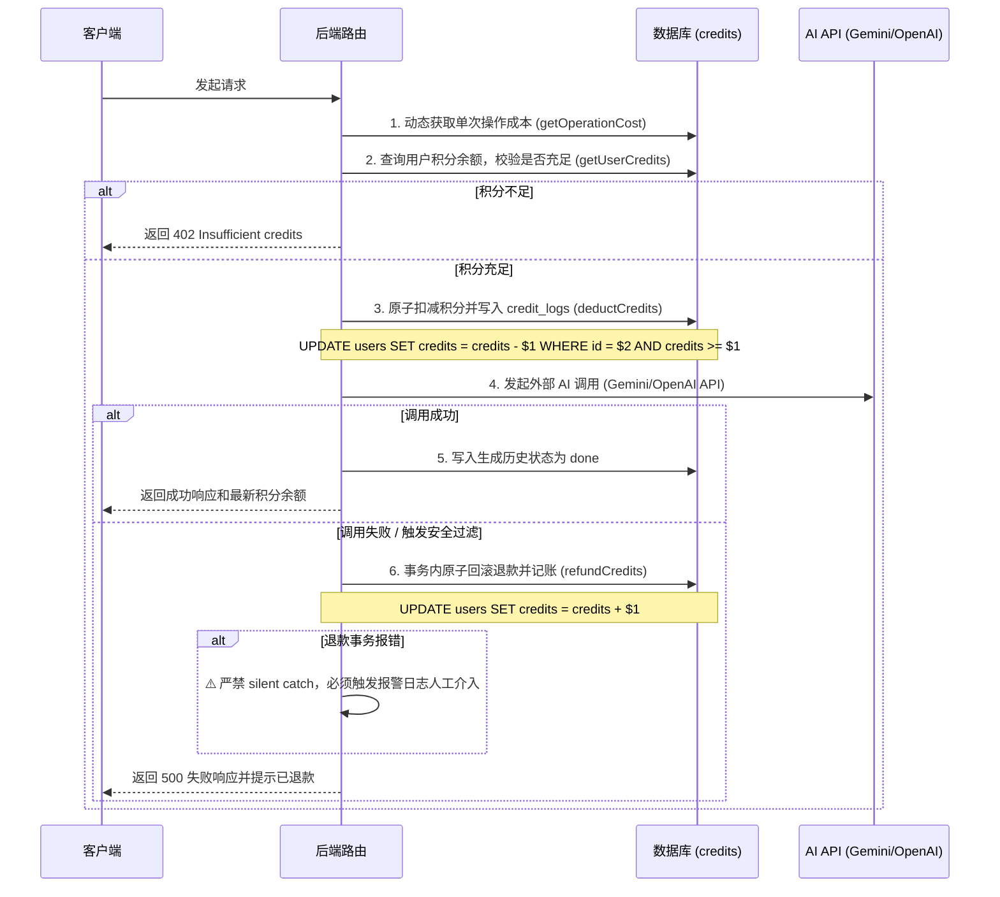

# KK-Studio 项目开发规范与架构黄金法则 (AGENTS.md)

本手册为 KK-Studio 项目的核心架构与开发准则。任何新功能的开发、重构、维护，以及 AI Agent 辅助编程，均必须严格遵循本规范。

---

## 1. 项目全局架构与目录职责规范

整个项目采用 Monorepo 架构组织，各模块职责严格划分，严禁跨模块越权导入非目标平台的组件或 API：

* **apps/web/**：桌面端 Web 应用（Vite + React + TypeScript）。严禁在此引入 React Native 组件。
* **apps/mobile/**：移动端应用（Expo Managed Workflow + React Native）。严禁使用任何浏览器 DOM/BOM 专属 API（如 `window`、`document` 等）。
* **packages/shared/**：两端共用核心业务包（纯 TS 编写，零平台依赖）。严禁引入任何含有 window 或 RN 环境特征的代码。
* **packages/api-client/**：统一 HTTP 调用层（两端共用），处理 baseURL 智能解析、Fetch 封装及 JWT 令牌注入。
* **packages/ui/**：共享基础 UI 组件库，必须在桌面端和移动端均能无副作用运行。
* **server/**：VPS 后端主服务（Express.js）。所有 API 路由及业务逻辑的宿主，坚决贯彻快速失败与防注入安全策略。
* **migrations/**：PostgreSQL schema 迁移目录。**唯一允许修改数据库 schema 的地方**，严禁在业务代码中执行 DDL 语句。

---

## 2. 后端核心安全与密钥校验准则

1. **快速失败机制**：后端服务（`server/index.js`）在启动时，必须对所有必需的环境变量进行强校验（包含 `GEMINI_API_KEY`, `OPENAI_API_KEY`, `JWT_SECRET`, `PASSWORD_SALT`, `DATABASE_URL`, `STRIPE_SECRET_KEY`, `STRIPE_WEBHOOK_SECRET`）。若任何一个缺失，服务**必须立即抛出异常并拒绝启动**，严禁使用硬编码默认值或弱兜底。
2. **CORS 精确源匹配**：
   * 严禁配置 `Access-Control-Allow-Origin: *` 配合 `credentials: true`。
   * 必须通过精确的 Origin 白名单匹配（生产环境白名单如 `kkai.plus`）和本地开发环境正则（允许匹配 `localhost`/`127.0.0.1` 任意端口）进行动态反射注入。
   * 除 Stripe Webhook 路由（Stripe 服务端直连，不走 CORS）外，所有接口必须统一注入 `X-Content-Type-Options: nosniff` 和 `X-Frame-Options: DENY` 安全头部。
3. **数据库防注入**：所有 SQL 查询必须使用参数化查询（如 `pool.query('SELECT ... WHERE id = $1', [userId])`），绝对禁止字符串拼接拼接 SQL 语句。

---

## 3. 积分扣减与失败退款黄金机制（Credits Transaction）

积分系统作为商业化核心，必须坚决杜绝任何白嫖或逃单漏洞。所有扣积分的 API 接口必须强制贯彻以下**先扣后退与原子性操作流程**：

### 3.1 核心调用时序（时序绝对不可打乱）

### 3.2 扣积分技术规约
1. **原子扣减**：扣积分更新 SQL 必须带防负数锁机制：`UPDATE users SET credits = credits - $amount WHERE id = $userId AND credits >= $amount RETURNING credits`。更新行数为 0 则必须立即抛错阻断，防止高并发下产生负积分。
2. **审计日志留痕**：所有的积分变动（扣积分 `ai_deduct`、退款 `ai_refund`、充值 `stripe_webhook`/`admin_recharge`、管理员手动调整 `admin_adjust`）必须同步在一笔事务中向 `credit_logs` 表记账，明确记录变动量、变动原因、变动后余额及操作人 ID。
3. **安全边界**：
   * 严禁在代码中硬编码积分消耗数量，必须统一使用 `getOperationCost(operationKey)` 动态读取定价表。
   * 严禁在注册接口直接向数据库写入赠送余额（默认一律为 0，需走充值链路）。
   * 管理员手动积分调整必须加保护措施：`UPDATE users SET credits = GREATEST(0, credits + $delta) WHERE id = $userId`。

---

## 4. 管理后台与多级权限鉴权规范

1. **多级权限定义**：
   * `admin_level === 0`：普通用户，不具有任何管理员操作权限。
   * `admin_level === 2`：普通管理员，可访问并操作「充值管理」、「积分管理」和「API 设置」。
   * `admin_level === 1`：超级管理员，除 2 级权限外，独占「人员管理（提升或降级普通管理员）」权限。
   * ⚠️ 严禁通过 API 将用户设为 `1` 号超级管理员，超级管理员有且仅能由系统初始化时在数据库直接配置。
2. **不信任 JWT 鉴权规约**：
   * 普通接口使用 `authMiddleware` 校验。
   * 管理后台路由（`/api/admin/*`）必须统一经过 `adminAuth(requiredLevel)` 中间件拦截。
   * **安全法条**：鉴权中间件内部**严禁直接信任并读取解密 JWT 中携带的 adminLevel 字段**，必须每次实时查询数据库（`SELECT admin_level FROM users WHERE id = $1`），以防管理员被降权或注销后，仍持有未过期 Token 越权操作。
3. **前端路由守卫（UI 守卫）**：
   * 桌面端管理后台采用 `AdminLayout.tsx` 作为父级框架，配合 React Context 中的用户信息实施路由防跨越。
   * 当前端检测到 `adminLevel === 0` 时，必须立即 `navigate("/")` 拦截重定向；对于 `/admin/staff`（人员管理）页面，当 `adminLevel !== 1` 时必须重定向至 `/admin`。

---

## 5. 外部 AI 接口集成核心规约

### 5.1 Gemini API (图像生成与编辑集成)
1. **模型锁定**：图像接口一律强制且静态写死使用模型 `"gemini-2.5-flash-image"`。严禁将其提取为运行时变量或传参，确保行为可控。
2. **多模态与参考图处理**：
   * 发送参考图给 Gemini 之前，必须在后端强制清除 Data URI 的 Base64 前缀（即移除 `data:image/\w+;base64,`），仅保留裸 base64 文本发送，否则 Google SDK 将抛出 400 异常。
   * 在前端返回图片时，必须重新拼装为标准的 Data URI 格式：`data:${mimeType};base64,${data}`。
3. **图像配置定位（aspectRatio）**：
   * 纵横比参数必须严格写入在 `config.imageConfig.aspectRatio` 节点下（取值必须符合 `"1:1" | "16:9" | "9:16"` 限制）。
   * 严禁错写到外层 `config.aspectRatio`，这会被 SDK 静默忽略。
   * 必须使用 API SDK 的 `Modality.IMAGE` 枚举声明返回格式。
4. **安全过滤捕获**：
   * Gemini API 触发内容安全敏感拦截时，其响应中将不含图像 data 节点。后端必须显式检测该节点是否存在，如为空则表明触发安全过滤，必须抛出明确异常并在 catch 中退还积分，严禁向上游返回空数据。

### 5.2 OpenAI API (对话集成)
1. **链路追踪 (Trace Id)**：
   * 所有向 OpenAI 发起的 Chat 接口调用，在 option 参数中必须附加包含 UUID 的 `"X-Client-Request-Id"` 链路追踪 Header，便于日志排查。
2. **安全 Zod 校验**：
   * 发往 OpenAI 的 messages 数组参数必须通过 Zod Schema 进行强类型格式校验，强制限定 role 在 `["system", "user", "assistant"]` 枚举内，防止 role 注入漏洞；同时严格限制 content 长度与数组项数限制。

---

## 6. UI/UX 商业级美学设计与自适应交互法则

作为面向未来的 Web 应用，所有 UI/UX 设计不仅要满足功能，更要在首屏展现时带给用户极富质感和高级感的感官体验（Rich Aesthetics）：

### 6.1 极致视觉与防抖排版规约
1. **防止滚动条挤压与最右侧裁剪（Scrollbar Gutter）**：
   * 全局及设置页主滚动面板（如 `.settings-shell-page`）必须强加 `scrollbar-gutter: stable;` 属性。确保无论滚动条是否显现，页面最右侧都恒定预留滚动条站位，根治页面内容因滚动条显隐切换造成的横向抖动。
   * 卡片网格容器必须设置 `overflow-x: visible !important;`，消除物理裁剪限制，确保最右侧卡片在滑动条产生时不被生硬切角。
2. **严格的卡片物理尺寸锁定（单元格 A 公式）**：
   * 为防止 Grid 自适应伸缩导致卡片内部多列多行的子元素重叠和截断，对大卡片网格容器必须引入高优先级尺寸限制。
   * 确立以单元格 A（宽 `270px`，高 `130px`，间隙 `16px`）为基础的响应式宽高锁定公式：
     * **1A**：`270px * 130px`
     * **2A宽 (2-col)** = $2 \times 270\text{px} + 16\text{px} = 556\text{px}$
     * **3A宽 (3-col)** = $3 \times 270\text{px} + 32\text{px} = 842\text{px}$
     * **4A宽 (4-col)** = $4 \times 270\text{px} + 48\text{px} = 1128\text{px}$
     * **2row高 (2-row)** = $2 \times 130\text{px} + 16\text{px} = 276\text{px}$
     * **3row高 (3-row)** = $3 \times 130\text{px} + 32\text{px} = 422\text{px}$
     * **4row高 (4-row)** = $4 \times 130\text{px} + 48\text{px} = 568\text{px}$
3. **全局横向对齐线与自适应布局**：
   * 页面主内容区的面包屑、Hero Title 标题和卡片网格首列的左边界，在横向上必须完全锁定在同一垂线上对齐（桌面端锁定 `28px` 左内边距，侧边栏宽度精准缩收锁定为 `260px`）。
   * 容器必须设置为 `justify-content: start !important;`，并通过 `flex-grow` 填充。当卡片数量极少（如仅 1 个 A 卡片）时，容器应贴紧左侧对齐线，并在右侧自然流畅地舒展，严禁局促居中以消除两侧大面积无内容荒凉感。
4. **指标数字突出与 tabular-nums 防跳动**：
   * 大幅突出重点指标数字：`InfoCell` 数值字号由 `text-[15px]` 显着增大为 `text-[20px] font-bold`，普通指标提升到 `20px`，首位核心主指标提到 `26px`，仪表盘核心迷你数值提到 `24px`。
   * 所有用于展示频繁跳动数值的容器，在 CSS 中必须注入数字等宽属性 `font-variant-numeric: tabular-nums`，使得数据实时跳动时排版稳定不跳闪。
5. **新建/编辑三级编辑器全宽对齐**：
   * 所有的三级详情表单卡片物理宽度必须设定为 4A 满宽（即 `max-width: 1128px !important;`），所有输入表单框和操作控件继承全宽标准，确保与主卡片网格的物理左右边界严丝合缝。

### 6.2 幽灵置灰拦截方案（Ghost Disabled Interception）
* **核心痛点**：为了兼容自动化契约和回归测试的静态检测，源码中必须严格保留 `disabled={...}` 的 React/JSX 原装写法，不可删除该属性。然而，普通的置灰按钮会导致用户点击“零反应”，造成极差的冰冷交互体验。
* **解决方案**：在四大通用按钮组件（`SettingsActionButton`、`PrimaryButton`、`SecondaryButton` 和 `DangerButton`）内部实施置灰拦截解析：
  1. **全局感知**：组件读取同步了只读降级状态的全局标志位 `window.__KK_SETTINGS_READONLY__`。
  2. **剥离原生 disabled 属性**：在满足置灰（如云端快照只读/本地环境未连通）时，在底层原生 HTML 元素上**不施加 `disabled` 属性**，而是将置灰样式以 CSS 类名模拟（`opacity-40 cursor-not-allowed pointer-events-auto`），并屏蔽 hover 动画。
  3. **完美的 onClick 响应**：由于剥离了原生 `disabled`，当用户点击该置灰按钮时，`onClick` 事件能够顺利捕获并执行。在页面处理器的头部，会自动触发环境检测（如 `ensureUserApiActionsAllowed()`），为用户弹出包含如何连通并启动本地环境的具体人文关怀弹窗（`notify.warning`）。
  4. **表单验证兜底**：若非只读降级状态，而是由于普通表单内容校验不合法触发的 disabled 状态，按钮必须老实保留原生的 `disabled` 属性以确保表单防非法提交。

### 6.3 工作台 Simple/Advanced 深度分流
* **简约视图（Simple View）**：在 `showAdvancedWorkbench` 为 `false` 时，仅展示 1A 型的极简卡片和一键录入 API 密钥的引导，剔除一切高阶链路、Facts诊断和繁冗 metrics。
* **高级视图（Advanced View）**：开启后，完全唤醒功能控制台，显示复杂的链路事实池与全量 metrics。

### 6.4 细节交互微动效
1. **多端网格间距规范**：
   * **移动端（断点 < 768px）**：卡片排布强制一排 1 列，二级菜单默认全屏，顶栏 32px 规范组件对齐，背景使用透明度渐变（安全区往后降为 100% 透明以防遮挡）。
   * **电脑端（断点 >= 1024px）**：Master-Detail 布局（缩放时左侧边栏精简、右侧显示详情），主网格 2-4 列，支持卡片 Grid Span 大小权重。
2. **高亮主题指示灯交互**：
   * 选中支付渠道时，呼吸灯 glow 与指示灯动态切换为对应的品牌色：支付宝蓝色（`#1677ff`）、微信绿色（`#22c55e`）、Stripe金色（`#eab308`）。
3. **AI 助手折叠与挤压动效**：
   * 右侧折叠箭头伴随微光动效，展开时**挤压画布容器**而非悬浮遮挡。
   * 工具栏与缩放条无操作时流畅渐变收缩为 `6px` 纤细线条，悬停或点击弹性恢复。
4. **字体一致性规范**：
   * 全局强制首位采用 `"HarmonyOS Sans SC"` 字体，杜绝混用等宽 `font-mono`（除非代码块展示）。
   * 提供完备的降级兜底链：`"HarmonyOS Sans SC"`, `"Inter"`, `"SF Pro Display"`, `-apple-system`, `BlinkMacSystemFont`, `"Segoe UI"`, `Roboto`, `Helvetica`, `Arial`, `sans-serif`。
5. **滑动超时续期**：
   * API 请求校验通过后，后端在 Response Header 中注入 `X-Refresh-Token` 携带 7 天新 JWT；前端响应拦截器检测到后自动更新 Local/SessionStorage 并无感知滑动续期。

---

## 7. 代码注释与书写规范

1. **中文注释**：根据全局规范，**所有代码的注释和文档字符串（JSDoc / TSDoc）必须使用简体中文编写**，且注释需着重说明“为什么要这样写”而不是“代码做了什么”。
2. **提交信息契约**：Git Commit Message 必须严格遵循约定式提交（Conventional Commits），限定前缀为：`feat`, `fix`, `refactor`, `chore`, `test`, `docs`, `style`。