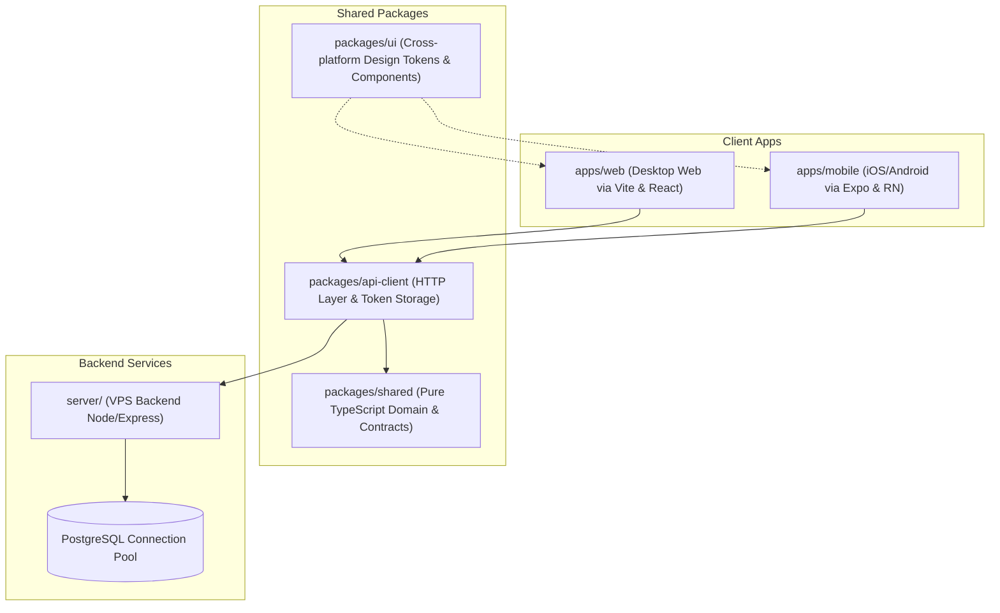

# KK Studio v1.5.2

> **下一代面向 AI 创作、无限画布与智能模型路由的多模态 AI 工作台。**
> 
> KK Studio 将提示词编排、多模型智能路由、用户自主密钥、多端云同步与商业化计费/审计深度融为一体，为创意工作者和开发团队提供高效、安全、极致流畅的创作体验。

---

## 🌟 核心能力与设计愿景

### 🎨 极致的商业级设计美学 (Design Aesthetics)
* **Glassmorphism 磨砂玻璃态**：遵循 Apple 级视觉规范，采用微透与流畅的阴影过渡，构建高级的主题层次。
* **物理吸附画布**：支持组件网络物理吸附、卡片弹性折叠与连线，将原本散乱的 Prompt 编排过程变为直觉式的“搭积木”体验。
* **微动效与自适应流式排版**：全面适配桌面端（Vite + React）与移动端（Expo + React Native），提供高帧率微交互。

### 🤖 智能模型路由与多供应商分发 (Model Routing)
* **协议层屏蔽**：前端无需关注各家 API 的底层协议差异，通过统一 HTTP Layer（`packages/api-client`）实现接口的强类型对接。
* **混合云协同与自主密钥**：支持本地零配置直连外部 Provider，或由安全加密通道同步至云端，在保护用户隐私的同时赋予极高的定制自由度。
* **多模型热切换**：管理后台支持多 Provider 的 API 端点、模型参数和密钥的热更新与灰度分发。

### 🔒 商业级计费、安全与退款审计 (Credits Transaction)
* **原子级积分扣减锁**：基于 PostgreSQL 事务，实现“预扣积分 -> 调用 AI 接口 -> 成功结算 / 失败自动退款”的闭环，彻底防范并发负分与资损漏洞。
* **分级管理员控制台**：内置 0/1/2 级权限验证。超级管理员拥有最高的系统配置权限，而普通管理员则负责日常的充值与模型参数微调。
* **Stripe 订阅闭环**：通过经过严格签名验签的 Webhook，打通在线订阅与自动充值链路。

### 🚀 v1.5.2 最新升级特性
* **主题自适应界面**：侧边栏与模型供应商的 Logo 经过深度适配，支持在深色和浅色主题下智能切换，展现更高质感的暗黑模式对比度层次。
* **黄金比例供应商布局**：卡片 UI 的整体布局遵循了严格的黄金比例规范，信息排列更加美观与易读。
* **本地用户路由代理**：集成了自主路由 API 代理模块，支持离线状态下的画布编辑，并能够智能判定与平滑回退至 VPS 备用路由。
* **安全闭环增强**：后端接入了更加严密的请求体容量限制规范，并自动注入主流安全防护请求头，杜绝越权与跨站利用隐患。
* **移动端灯箱 UX 优化**：大幅改善移动端在生成列表遭遇失败时的提示逻辑，列表卡片仅提示常规错误，只有在用户点击放大进入灯箱时才展示详细错误原因，界面表现更加大方。

---

## 🏗️ 架构与分工 (System Architecture)

KK Studio 采用 Monorepo 多包管理结构，各模块边界分工明确：



### 📂 目录职责矩阵

| 目录/包名 | 核心职责 | 技术栈 | 隔离规则 |
| :--- | :--- | :--- | :--- |
| [`apps/web/`](file:///c:/Users/Administrator/Downloads/KK-Studio-1.0.0/apps/web) | 桌面端无限画布主应用 | React 19 + TypeScript + Vite | **禁止** 引入 React Native 与 Expo API |
| [`apps/mobile/`](file:///c:/Users/Administrator/Downloads/KK-Studio-1.0.0/apps/mobile) | 原生移动端 App | Expo + React Native | **禁止** 直接调用浏览器特有的 DOM/BOM 接口 |
| [`packages/shared/`](file:///c:/Users/Administrator/Downloads/KK-Studio-1.0.0/packages/shared) | 业务模型定义、类型与核心契约 | 纯 TypeScript (ESM) | **禁止** 引入任何含平台特征（如 `window`, RN 标签）的代码 |
| [`packages/api-client/`](file:///c:/Users/Administrator/Downloads/KK-Studio-1.0.0/packages/api-client) | 强类型 HTTP 请求封装及多端 Session 管理 | Axios + React Query | 本地存储（localStorage / SecureStore）需通过依赖注入解耦 |
| [`packages/ui/`](file:///c:/Users/Administrator/Downloads/KK-Studio-1.0.0/packages/ui) | 跨端共享设计系统与 UI Token 预设 | CSS Variables + Component Presets | 必须保持平台无副作用 |
| [`server/`](file:///c:/Users/Administrator/Downloads/KK-Studio-1.0.0/server) | 后端 Express 运行时，处理 API 代理、计费、Stripe Webhook | Express.js + pg (Connection Pool) | **禁止** 引入 React 等前端 UI 库 |
| [`migrations/`](file:///c:/Users/Administrator/Downloads/KK-Studio-1.0.0/migrations) | 数据库 Schema 迁移，DML/DDL 唯一来源 | 参数化 SQL 语句 | 严禁编写任何带有业务逻辑的处理代码 |

---

## 🛠️ 快速启动 (Quick Start)

### 1. 环境准备
确保您的本地开发环境已安装 **Node.js 22.x/24.x** 且包管理器使用 **npm 10.x/11.x** (或 Bun)。

### 2. 配置环境变量
在项目根目录复制 `.env.example`，并补全本地/生产环境的密钥配置：
```bash
cp .env.example .env
```
> [!WARNING]
> 绝对禁止将包含真实 API 密钥或密码的 `.env` 文件提交至 Git 仓库，确保它们已被 `.gitignore` 规则完全覆盖。

### 3. 安装依赖与构建共享包
```bash
npm install
npm run build -w packages/api-client
```

### 4. 启动开发环境
```bash
# 同时启动后端 Express 服务与前端 Vite 调试服务器
npm run dev:start
```
开发环境启动后：
* Web 端入口：[http://localhost:3000](http://localhost:3000)
* API 代理服务端口：`3001`
* 移动端（Expo）：`cd apps/mobile && npx expo start`

---

## 📈 版本与构建治理 (Governance)

项目部署了严格的代码质量门禁，每次提交或合并前都必须通过回归审查：

```bash
# 一键运行完整验证链（包含架构边界、版本一致性、代码安全检查、类型校验、编译及单元/集成测试）
npm run verify:changes
```

### 📌 关键治理任务分类说明
* **架构边界检查** (`npm run architecture:check`)：检查跨模块引入是否违规（如 Web 引入了 RN 依赖）。
* **版本一致性校验** (`npm run governance:check`)：以 `config/release-manifest.json` 为版本唯一事实来源，强制校验所有 package.json 以及发布清单。
* **安全审计扫描** (`npm run governance:security`)：核实是否存在敏感日志泄露或前端硬编码官方域名等安全合规风险。
* **编码与测试回归** (`npm run test`)：跑通端到端的单元测试与集成冒烟测试。

---

> [!NOTE]
> 本项目遵循严格的 [AGENTS.md](file:///c:/Users/Administrator/Downloads/KK-Studio-1.0.0/AGENTS.md) 开发范式，请在编写任何业务逻辑前仔细阅读其定义的安全边界与时序要求。
