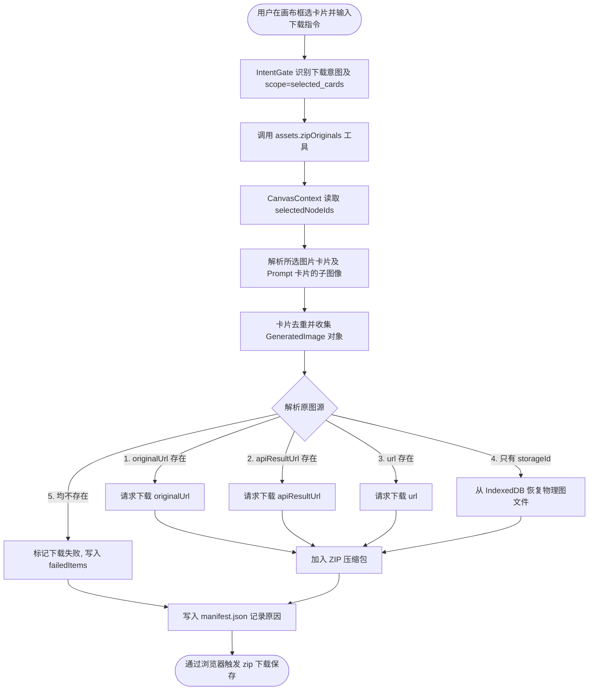
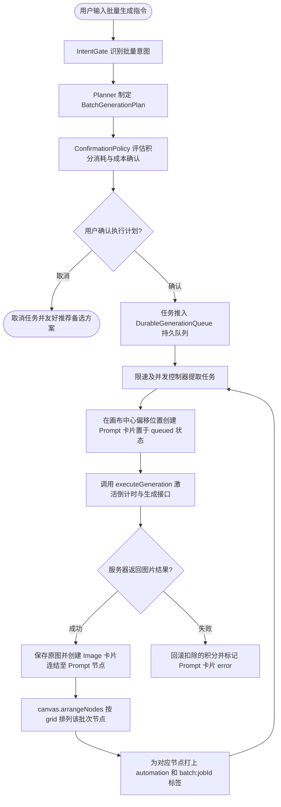

# 流程地图 (Flow Map)

本文件整理了 KK Studio v1.5.3 的核心工作流流转路径。

---

## 1. 下载选中卡片原图工作流

用户触发：“打包下载我选中的图” / “下载这些卡片的原图”

### Implementation update - 2026-06-03

The selected-original download path is implemented by:

- `apps/web/src/features/assets/resolveOriginalAssets.ts`
- `apps/web/src/features/assets/zipOutputs.ts`
- `apps/web/src/features/ai-takeover/core/toolRegistry.ts`

Runtime rule: `selected_cards` never means all canvases. It means the current `selectedNodeIds`; selected Prompt cards expand to their child image nodes. The ZIP source resolver tries `originalUrl`, then `apiResultUrl`, then `url`, then `storageId`, then local asset recovery. `manifest.json` is always written, including manifest-only archives when every download fails.

---

## 2. 批量生成并自动整理工作流

用户触发：“批量生成 30 张头像，整理成卡片组”

