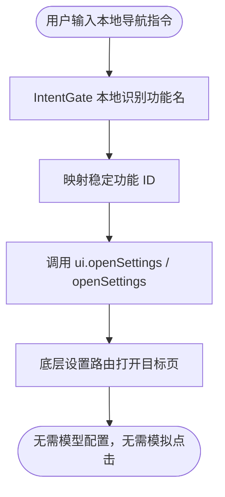
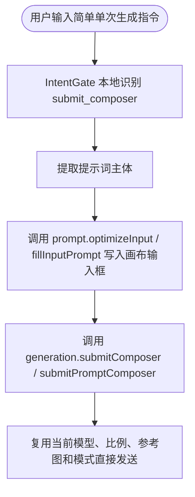
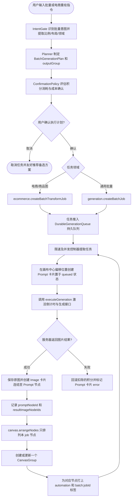

# 流程地图 (Flow Map)

本文件整理了 KK Studio v1.5.8 的核心工作流流转路径。

---

## 0.1. Global Favorites And @ Reference Flow - 2026-06-05

User trigger examples: typing `@` in PromptBar, ChatSidebar, or AI takeover dock; clicking a favorite prompt/image; clicking the heart action on an image or Prompt card.

```mermaid
graph TD
    FocusedComposer[Registered composer focus] --> Registry[favoriteComposerRegistry]
    UserAt[User types @] --> Panel[ReferenceMentionPanel]
    Panel --> UploadTab[Uploaded: PromptBar refs + assistant asset pool images/files]
    Panel --> TagTab[Tags: loaded canvas images with image tags or inherited Prompt tags]
    Panel --> LikedTab[Liked: global favorite images]
    LikedLibrary[Draggable FavoritesPanel floating window] --> Registry
    Registry --> PromptBar[PromptBar composer]
    Registry --> Assistant[ChatSidebar composer]
    Registry --> Dock[AI takeover dock composer]
    PromptBar --> PromptRefs[Insert @name and add image to config.referenceImages when image attachable]
    Assistant --> AssistantContext[Insert @name and attach image/file context when available]
    Dock --> DockContext[Insert @name and rely on takeover resource pool or favorite mention]
    PromptRefs --> Submit[Generation submit]
    Submit --> ParseMentions[parse @name and @name[dimension]]
    ParseMentions --> ReorderRefs[Reorder referenceImages by mention order]
    ReorderRefs --> Mapping[Append internal Reference mapping summary]
    Mapping --> Generation[Run existing generation transaction]
```

Rules:

- Inserted text stays natural: `@Name`.
- User-authored dimensions such as `@Name[face]` are preserved in the internal mapping summary.
- Non-image files are assistant context only. PromptBar inserts the text label but does not attach the file to image generation.
- Favorite deletion removes only the favorite record and mirror blobs. It must not delete the original canvas image.
- Favorite image rename updates the favorite display name; if the source image node is loaded, update `GeneratedImage.alias` so search can find it.
- The heart Favorites surface is not the `@` popup. Favorites opens as a draggable floating collection window with Chinese copy; the `@` popup opens above the current token in the active composer.

## 0. 本地快速功能跳转工作流

用户触发：“帮我打开个人中心” / “帮我打开 API” / “打开日志”



功能 ID 映射：

| 用户说法 | 功能 ID |
| :--- | :--- |
| 个人中心 / 用户中心 / 我的账号 | `user-profile` |
| API / API 工作台 / 接口设置 | `api-management` |
| 日志 / 系统日志 / 运行日志 | `system-logs` |
| 存储 / 容量 / 空间 | `storage-settings` |
| 计费 / 账单 / 消费记录 | `consumption-records` |
| 设置总览 / 设置首页 | `dashboard` |

规则：UI 位置变化不改变该流程。开发者只需同步 UI Map、Skill 和 ToolRegistry 映射，AI 助手仍控制底层功能线路。

## 0.5. 简单生成直发工作流

用户触发：“生成一个白色产品海报” / “帮我生成一个赛博猫头像”



若用户要求“批量”“每张参考图分别生成”“文件夹每张图都做一张”，不得走简单直发，应进入批量生成和确认流程。

## 1. 下载选中卡片原图工作流

用户触发：“打包下载我选中的图” / “下载这些卡片的原图”


### Implementation update - 2026-06-03

The selected-original download path is implemented by:

- `apps/web/src/features/assets/resolveOriginalAssets.ts`
- `apps/web/src/features/assets/zipOutputs.ts`
- `apps/web/src/features/ai-assistant-runtime/tools/ToolRegistry.ts`

Runtime rule: `selected_cards` never means all canvases. It means the current `selectedNodeIds`; selected Prompt cards expand to their child image nodes. The ZIP source resolver tries `originalUrl`, then `apiResultUrl`, then `url`, then `storageId`, then local asset recovery. `manifest.json` is always written, including manifest-only archives when every download fails.

---

## 2. 批量生成并自动整理工作流

用户触发：“批量生成 30 张头像，整理成卡片组” / “帮我把这个文件夹里面的图片全部修改成紧凑的排版布局，比例改成4:5”



### Implementation update - 2026-06-05

Assistant batch output must be grouped by one conversation run or one batch job. `IntentGate` now extracts `taskDomain`, `aspectRatio`, `layoutPreset`, and `outputGroup`; commands such as “紧凑的排版布局，比例4:5” map to `taskDomain='ecommerce'`, `aspectRatio='4:5'`, and `layoutPreset='compact-grid'`.

After `generation.createBatchJob` or `ecommerce.createBatchTransformJob` creates prompt/image nodes, `DurableGenerationQueue` records each `promptNodeId`, result image node IDs, and `outputGroup`. The completion handler collects only this job's nodes, calls targeted `canvas.arrangeNodes({ nodeIds, preset })`, then creates or updates one `CanvasGroup` for that run. Store a readable group label, default `color: '#ffffff'`, and tags such as `automation` and `batch:<jobId>`.

Group control semantics:

- `group.hidden=true`: blur/hide visually only. Cards stay in render queues and connectors stay available.
- `group.collapsed=true`: compact storage strip. Member cards are filtered by `getCollapsedCanvasGroupNodeIds`.
- `group.color`: weak inner glow color, selected from the group right-click menu.
- Group drag: write live member positions first, then commit via `moveSelectedNodesImmediate`, so the frame and cards move together.

For ecommerce-style commands such as "modify all images in this folder into a compact layout, ratio 4:5", the assistant plans an ecommerce/batch generation job, not PromptBar simulation. “文件夹里面的图片” currently resolves to the imported resource pool or image collection; future local directory selection must add an explicit filesystem permission flow.
